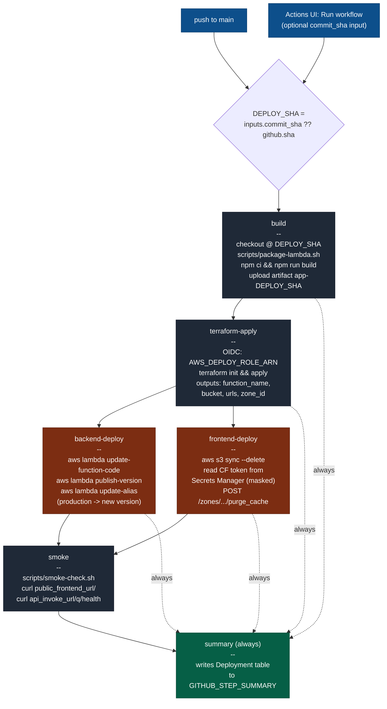

# Infrastructure (Terraform)

Manages the AWS and Cloudflare resources for StockTracker.

## Layout

```
infra/
├── bootstrap/            # One-time, manually applied. Creates Terraform state
│                          # backend (S3 + DynamoDB) and GitHub OIDC + IAM roles.
├── envs/
│   └── production/       # The single production environment for v1.
│                          # All other env/region targets are out of scope.
└── modules/              # Reusable building blocks (network, lambda, rds, etc.)
```

Module documentation lives next to the module's `main.tf`.

## One-time bootstrap

The bootstrap stack uses local state. Run it once per AWS account to provision
the things Terraform itself needs: the remote-state bucket, the lock table,
the GitHub OIDC provider, and the two IAM roles (`gha-plan-production` and
`gha-deploy-production`).

```bash
cd infra/bootstrap
terraform init
terraform apply \
  -var "github_org=koonliang" \
  -var "github_repo=stocktracker" \
  -var "aws_region=ap-southeast-1"
```

Record the outputs (`state_bucket_name`, `lock_table_name`, the two role ARNs)
into:

- `infra/envs/production/backend.tf` — replace the placeholder values for the
  state bucket and lock table.
- GitHub repository variables: `AWS_REGION`, `AWS_PLAN_ROLE_ARN`,
  `AWS_DEPLOY_ROLE_ARN`.

## First-time provisioning of `production`

```bash
cd infra/envs/production
terraform init
terraform plan -out=tfplan
terraform apply tfplan
```

Useful variables (see `variables.tf` for the full list):

- `aws_region` (default `ap-southeast-1`)
- `domain_name` (optional; leave empty to skip the API custom domain and
  Cloudflare wiring — uses the API Gateway default invoke URL)
- `acm_certificate_arn` (optional; required only when `domain_name` is set)
- `provisioned_concurrency` (default `0`)

## Required GitHub branch protection (configure once, manually)

On `main`:

- Require pull-request review before merge (no direct pushes).
- Require status check `gates` to pass before merging. `gates` is the single
  required check — it aggregates `backend-test`, `frontend-test`, and
  `terraform-plan` (the latter is reported as success when no `infra/**`
  files changed in the PR). See `.github/workflows/ci.yml`.
- Require linear history (squash- or rebase-merge only — no merge commits)
  so every change on `main` corresponds to exactly one PR.
- Require branches to be up to date before merging.

## Pipelines

Three workflows live in `.github/workflows/`:

- `ci.yml` — runs on every PR against `main`. Backend tests, frontend tests,
  optional `terraform-plan` (when `infra/**` files change). Aggregated by a
  single required `gates` check. No AWS write access from this workflow.
- `cd.yml` — deploys to production. Two ways to start it (see below).
- `rollback.yml` — `workflow_dispatch` only. Redeploys the artifact built for
  a previously successful CD run by 40-char `commit_sha`.
- `drift-check.yml` — runs daily on `cron 0 2 * * *` (and on demand via
  `workflow_dispatch`). Executes
  `terraform plan -refresh-only -detailed-exitcode` against
  `infra/envs/production/` using the same `AWS_PLAN_ROLE_ARN` OIDC role as
  CI. When the plan reports drift (exit code `2`) the workflow opens (or
  updates, if one is already open) a GitHub issue labelled `drift` containing
  the truncated plan output. No AWS write access; the workflow never applies.

### Triggering CD

`cd.yml` accepts both an automatic and a manual trigger:

| How | Event | Which commit gets deployed |
|-----|-------|----------------------------|
| Merge a PR to `main` | `push` | The merge commit on `main` (`github.sha`) |
| GitHub UI → Actions → **CD** → **Run workflow** (input `commit_sha` left blank) | `workflow_dispatch` | Whatever `main` points at right now |
| Same UI flow with a 40-char SHA in `commit_sha` | `workflow_dispatch` | That specific commit (artifact named `app-<sha>` so `rollback.yml` can find it) |

Internally the workflow resolves `DEPLOY_SHA = inputs.commit_sha || github.sha`
once at startup and uses it for the build checkout, the artifact name, the
Terraform checkout, the `aws lambda publish-version` description, and the
smoke-test checkout — so app code, infra code, and the smoke script are all
from the same commit.

The `concurrency: cd-production` group with `cancel-in-progress: false` means
overlapping triggers (e.g., a merge plus a manual run) **queue** rather than
race; you'll never get two parallel CD runs for production.

### CD job graph



Any failure stops the chain immediately — a failed `backend-deploy` skips
`smoke`; a failed `smoke` does **not** roll the alias back (the alias was
already swung in `backend-deploy`). True rollback requires running
`rollback.yml` against a known-good `commit_sha`.

### Required GitHub repo configuration (one-time)

Repository **variables** (`Settings → Secrets and variables → Actions → Variables`):

- `AWS_REGION`, `AWS_PLAN_ROLE_ARN`, `AWS_DEPLOY_ROLE_ARN` (from bootstrap outputs)
- `DOMAIN_NAME`, `ACM_CERTIFICATE_ARN`, `CLOUDFLARE_ZONE_ID` (leave blank for the no-domain mode)
- `PROVISIONED_CONCURRENCY` (optional; defaults to `0`)

Repository **secrets**:

- `CLOUDFLARE_API_TOKEN` — used by the Cloudflare Terraform provider during
  `terraform-apply`. Phase 7 (US5) moves the *runtime* token used for
  cache-purge into AWS Secrets Manager (`stocktracker/cloudflare/api_token`);
  the apply-time secret stays in GitHub.

## Environments

Only `production` exists in v1. Adding another environment (e.g. `staging`)
is intended to be a copy-and-override exercise — **the modules under
`infra/modules/` should not need to change**.

1. Copy the directory:

   ```bash
   cp -r infra/envs/production infra/envs/<new-name>
   ```

2. In `infra/envs/<new-name>/backend.tf`, change the `key` (and, if you want
   isolation, the bucket / lock-table) so the new env writes to its own
   state path — never share state with `production`.

3. In `infra/envs/<new-name>/main.tf` and `variables.tf`, override the
   per-env inputs as needed: `aws_region`, `domain_name`,
   `acm_certificate_arn`, `cloudflare_zone_id`, `provisioned_concurrency`,
   and any module-level toggles. Keep the module `source = "../../modules/..."`
   references unchanged.

4. Provision the new env's GitHub OIDC roles (re-run `infra/bootstrap/`
   with a different `github_repo`/role-name suffix, or hand-add roles
   scoped to the new env's state path) and add the matching repo
   variables (`AWS_PLAN_ROLE_ARN_<env>`, `AWS_DEPLOY_ROLE_ARN_<env>`, …)
   if you wire it into a separate workflow.

5. `cd infra/envs/<new-name> && terraform init && terraform apply`.

If a change really does require the modules themselves, treat that as a
shared-module change: update the module, and re-plan every env that
consumes it.

## What changes if `domain_name` and `acm_certificate_arn` are empty

- API Gateway is reachable at the AWS auto-issued
  `https://<api-id>.execute-api.<region>.amazonaws.com/`.
- Cloudflare module is **not** wired (no proxied DNS, no transform rule for
  the `X-Origin-Auth` header on the S3 bucket).
- Frontend is served either from the S3 website endpoint (test mode) or
  whatever fallback you configure. **Note that this violates FR-009** in
  the spec (S3 must not be publicly readable in production); use the
  no-domain mode only for ephemeral test cycles.
