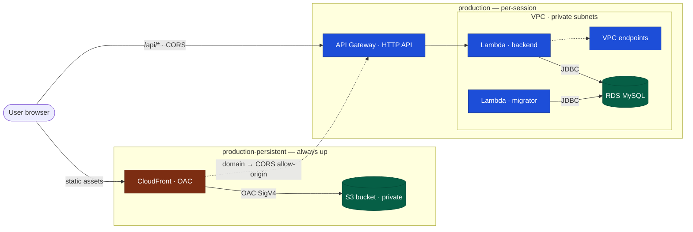
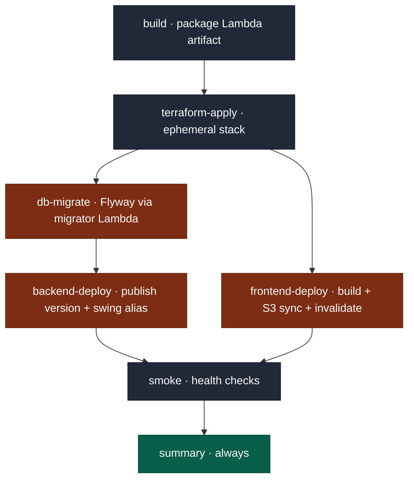

# Infrastructure (Terraform)

Manages the AWS resources for StockTracker. Production is split into two
Terraform stacks with independent state so the cost-bearing resources can be
torn down between test sessions while the cost-free CDN layer stays up.

## Architecture



The browser loads static assets from CloudFront, which serves the **private**
frontend bucket via Origin Access Control (SigV4-signed origin requests). It
calls the backend **cross-origin** at the API Gateway `/api/*` URL baked into
the bundle as `VITE_API_BASE_URL`; API Gateway (`ANY /{proxy+}`) proxies every
path to the backend Lambda, which reaches MySQL over JDBC inside the VPC. The
one-shot migrator Lambda runs Flyway against the same database on deploy.
There is **no NAT gateway** — the private subnets reach AWS services (Secrets
Manager, CloudWatch Logs) through interface VPC endpoints. The ephemeral stack
reads the persistent CloudFront domain via `terraform_remote_state` so API
Gateway's CORS allow-origin always matches the live frontend.

Authentication in production is owned by an **Amazon Cognito** user pool
(`modules/cognito`) provisioned in the ephemeral `production` stack. It handles
email sign-up/verification, password reset, and optional Google/Facebook
federation (IdP credentials read from Secrets Manager, each created only when
its secret name is supplied). The backend Lambda runs with
`STOCKTRACKER_AUTH_MODE=cognito` and only validates pool-issued JWTs
(`COGNITO_ISSUER` / `COGNITO_JWKS_URL` wired from the module outputs); the app
client uses the authorization-code flow with callback/logout URLs derived from
the CloudFront domain. Verified-email account linking is done backend-side, so
no custom Cognito Lambda trigger is provisioned.

Not shown: the one-time **bootstrap** stack (local state) provisions the
Terraform state backend (S3 + DynamoDB lock) and GitHub OIDC + IAM roles — see
[One-time bootstrap](#one-time-bootstrap).

## Layout

```
infra/
├── bootstrap/                      # One-time, manually applied. Creates
│                                    # Terraform state backend (S3 + DynamoDB),
│                                    # GitHub OIDC + IAM plan/deploy roles.
├── envs/
│   ├── production-persistent/      # CloudFront + frontend S3 bucket.
│   │                                # Provisioned once and left up. ~$0 idle.
│   └── production/                 # VPC, RDS, Lambda, API Gateway.
│                                    # Apply at session start, destroy at end.
└── modules/                        # Reusable building blocks
    ├── api_gateway/
    ├── cloudfront/
    ├── cognito/                     # User pool, app client, optional IdPs
    ├── frontend_bucket/
    ├── lambda_backend/
    ├── lambda_migrator/
    ├── network/
    └── rds_mysql/
```

Module documentation lives next to each module's `main.tf`.

## Stack split — why two states?

A `terraform destroy` against a CloudFront distribution waits for AWS to
disable-and-delete the distribution (~10–20 min). CloudFront itself is free
when idle. Splitting the stacks means a 2-hour test session pays the
CloudFront wait **only once**, not on every cycle:

| Stack | Lifecycle | What it owns | Idle cost |
|---|---|---|---|
| `production-persistent` | Apply once, leave up | CloudFront, OAC, frontend bucket | ~$0 |
| `production` | Apply/destroy per session | VPC, RDS, Lambda, API Gateway, interface VPC endpoints | RDS + VPC endpoints dominate |

The ephemeral `production` stack reads the persistent stack's CloudFront
domain via `terraform_remote_state` so API Gateway CORS always allows the
live origin.

## One-time bootstrap

The bootstrap stack uses local state. Run it once per AWS account to provision
the things Terraform itself needs: the remote-state bucket, the lock table,
the GitHub OIDC provider, and the two IAM roles (`gha-plan-production` and
`gha-deploy-production`).

```bash
cd infra/bootstrap
terraform init
terraform apply \
  -var "github_org=koonliang" \
  -var "github_repo=stocktracker" \
  -var "aws_region=ap-southeast-1"
```

Record the outputs (`state_bucket_name`, `lock_table_name`, the two role ARNs)
into:

- `infra/envs/production/backend.tf` and
  `infra/envs/production-persistent/backend.tf` — replace the placeholder
  values for the state bucket and lock table.
- GitHub repository variables: `AWS_REGION`, `AWS_PLAN_ROLE_ARN`,
  `AWS_DEPLOY_ROLE_ARN`.

## First-time provisioning

Apply the persistent stack first, then the ephemeral stack.

```bash
# 1. Persistent stack — applied once, kept up between test sessions.
cd infra/envs/production-persistent
terraform init
terraform apply
# Outputs: cloudfront_distribution_id, cloudfront_domain_name, frontend_bucket_name.

# 2. Ephemeral stack — apply at the start of each test session.
cd ../production
terraform init
terraform plan -out=tfplan
terraform apply tfplan
# Outputs: api_invoke_url, lambda_function_name, plus pass-throughs of the
# persistent stack's CloudFront/bucket outputs.
```

Useful variables (see `variables.tf` for the full list):

- `aws_region` (default `ap-southeast-1`)
- `provisioned_concurrency` (default `0`)

v1 does not use a custom domain — the frontend is served on the default
`*.cloudfront.net` hostname (`cloudfront_domain_name` output) and the API
on the default API Gateway hostname (`api_invoke_url` output).

## Required GitHub branch protection (configure once, manually)

On `main`:

- Require pull-request review before merge (no direct pushes).
- Require status check `gates` to pass before merging. `gates` aggregates
  `backend-test`, `frontend-test`, and `terraform-plan` (the latter is
  reported as success when no `infra/**` files changed in the PR). See
  `.github/workflows/ci.yml`.
- Require linear history (squash- or rebase-merge only — no merge commits)
  so every change on `main` corresponds to exactly one PR.
- Require branches to be up to date before merging.

## Pipelines

Workflows live in `.github/workflows/`:

- `ci.yml` — runs on every PR against `main`. Backend tests, frontend tests,
  and `terraform-plan` (matrix across both stacks) when `infra/**` files
  change. Aggregated by a single required `gates` check. No AWS write access.
- `cd.yml` — applies the **ephemeral** stack and deploys the application.
- `cd-persistent.yml` — applies the **persistent** stack. Triggered only when
  files under `infra/envs/production-persistent/**`,
  `infra/modules/cloudfront/**`, or `infra/modules/frontend_bucket/**`
  change, plus `workflow_dispatch`.
- `destroy.yml` — `workflow_dispatch` only. Tears down the **ephemeral**
  stack. Persistent stack is intentionally untouched.
- `destroy-persistent.yml` — `workflow_dispatch` only, no schedule. Full
  wipe of the persistent stack. Used only when the project is being
  decommissioned.
- `rollback.yml` — `workflow_dispatch` only. Redeploys the artifact built
  for a previously successful CD run by 40-char `commit_sha`. Includes a
  CloudFront invalidation step.
- `drift-check.yml` — `workflow_dispatch` only (manual). Matrix across both
  stacks; opens a GitHub issue labelled `drift` per stack on detected drift.

### Triggering CD

`cd.yml` is **manual-only** (`workflow_dispatch`). There is no `push` trigger:
merging to `main` does not deploy, so the cost-bearing ephemeral stack is only
applied when you ask for it.

| How | Event | Which commit gets deployed |
|-----|-------|----------------------------|
| GitHub UI → Actions → **CD** → **Run workflow** (input `commit_sha` left blank) | `workflow_dispatch` | Whatever `main` points at right now (`github.sha`) |
| Same UI flow with a 40-char SHA in `commit_sha` | `workflow_dispatch` | That specific commit (artifact named `app-<sha>` so `rollback.yml` can find it) |

Internally the workflow resolves `DEPLOY_SHA = inputs.commit_sha || github.sha`
once at startup and uses it for the build checkout, the artifact name, the
Terraform checkout, the `aws lambda publish-version` description, and the
smoke-test checkout — so app code, infra code, and the smoke script are all
from the same commit.

The `concurrency: cd-production` group with `cancel-in-progress: false` means
overlapping manual runs **queue** rather than race; you'll never get two
parallel CD runs for production.

### CD job graph



Triggered manually (`workflow_dispatch`); `DEPLOY_SHA` is resolved once as
described above. `summary` runs regardless of upstream success/failure.

Any failure stops the chain immediately — a failed `backend-deploy` skips
`smoke`; a failed `smoke` does **not** roll the alias back (the alias was
already swung in `backend-deploy`). True rollback requires running
`rollback.yml` against a known-good `commit_sha`.

### Required GitHub repo configuration (one-time)

Repository **variables** (`Settings → Secrets and variables → Actions → Variables`):

- `AWS_REGION`, `AWS_PLAN_ROLE_ARN`, `AWS_DEPLOY_ROLE_ARN` (from bootstrap outputs)
- `PROVISIONED_CONCURRENCY` (optional; defaults to `0`)

Repository **secrets** (`Settings → Secrets and variables → Actions → Secrets`):

- None required. The RDS master password is an **RDS-managed secret**
  (`manage_master_user_password = true`): RDS generates and stores it in
  Secrets Manager, Terraform never sees the plaintext, and the Lambdas read it
  at startup directly via the AWS SDK (env var `DATASOURCE_PASSWORD_SECRET_ARN`).
  The interim `RDS_MASTER_PASSWORD` repo secret is no longer used and should be
  deleted.

No third-party API tokens are required — `GITHUB_TOKEN` is provided
automatically, and CloudFront invalidation uses the deploy role's IAM (already
SigV4 over OIDC).

## Adding another environment

The split applies per-environment: each new environment would similarly have
a `<name>-persistent/` and `<name>/` pair sharing the same modules.

1. Copy the directories:

   ```bash
   cp -r infra/envs/production-persistent infra/envs/<new-name>-persistent
   cp -r infra/envs/production            infra/envs/<new-name>
   ```

2. Change the `key` in each `backend.tf` so the new env writes to its own
   state paths — never share state with `production`.

3. Override per-env inputs in `main.tf` / `variables.tf`. Keep the module
   `source = "../../modules/..."` references unchanged.

4. Provision a separate set of OIDC roles (re-run `infra/bootstrap/` with a
   different `github_repo`/role-name suffix) and add the matching repo
   variables.

5. `terraform init && terraform apply` the persistent stack, then the
   ephemeral one.
